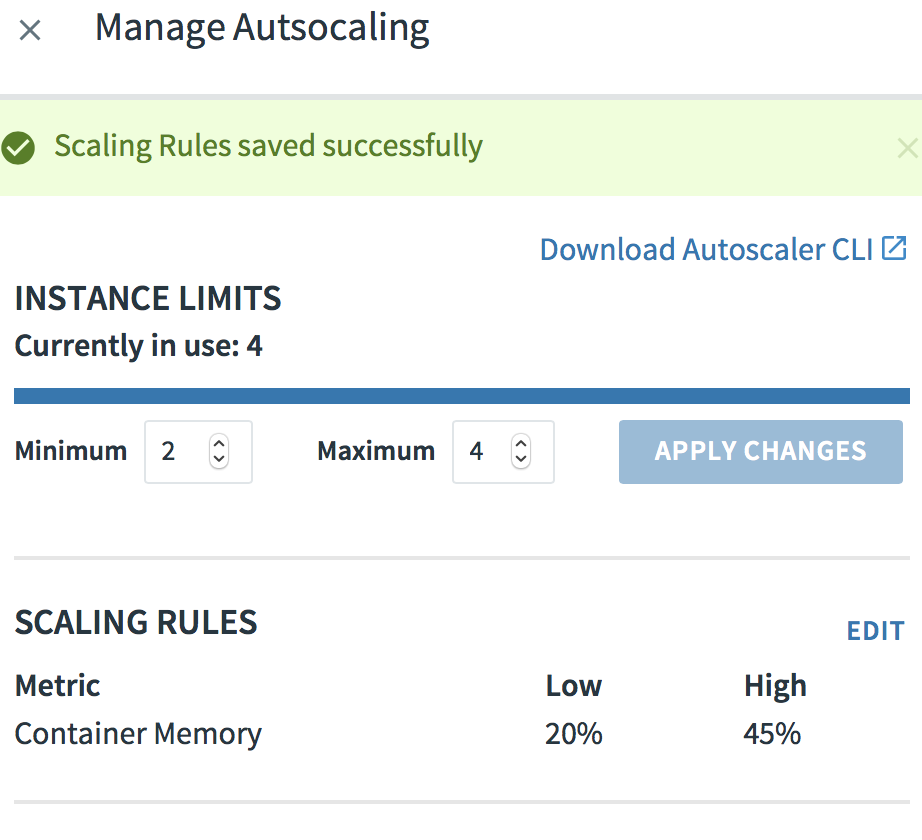

# PCF Memory Scaling Demo

Application demonstrating memory based scaling using PCF.

## Demo Steps

1. Build and deploy to PCF

```sh
gradle build
```

```sh
cf push scaling-demo -p build/libs/scaling-demo-0.0.1-SNAPSHOT.jar
```

2. Bind a AutoScaling Service to your Application, and configure it for Container Memory Scaling.

> Note - additional instances are scaled up when the average container memory amount exceeds the High Memory amount set in settings.  Not that this is total container memory and not allocated JVM memory.



3. Increase JVM Memory (by clicking on Fill buttons) , until total container memory hits threshold.


## Notes

1. Usage of X-CF-APP-INSTANCE header to route to specific containers instead of standard round robyn.

2. **api/info** endpoint for getting application information.

