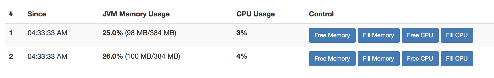

# PCF Memory and CPU Scaling Demo

Application demonstrating memory and CPU based scaling using PCF.

## Demo Steps

1. Build and deploy to PCF

```sh
gradle build && cf push
```

Note -- you may need to run *cf push* with **--random-route** if the route already exists

2. Bind a AutoScaling Service to your Application, and configure it for Container Memory or CPU Scaling.

> Note - for memory scaling additional instances are scaled up when the average container memory amount exceeds the High Memory amount set in settings.  Not that this is total container memory and not allocated JVM memory.


3. Increase JVM Memory / or CPU Load (by clicking on Fill buttons).



## Notes

1. Usage of X-CF-APP-INSTANCE header to route to specific containers instead of standard round-robin.

2. **api/info** endpoint for getting application information.

3. JVM Garbage Collection (and freeing of RAM) isn't instant (can take a few seconds)

4. CPU Usage indication in the GUI is laggy , and not always accurate (using *OperatingSystemMXBean* )

